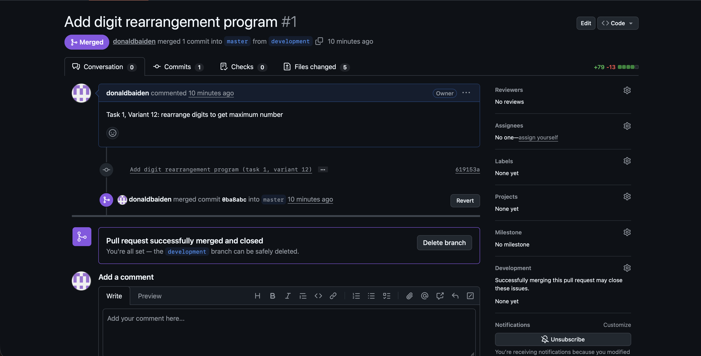
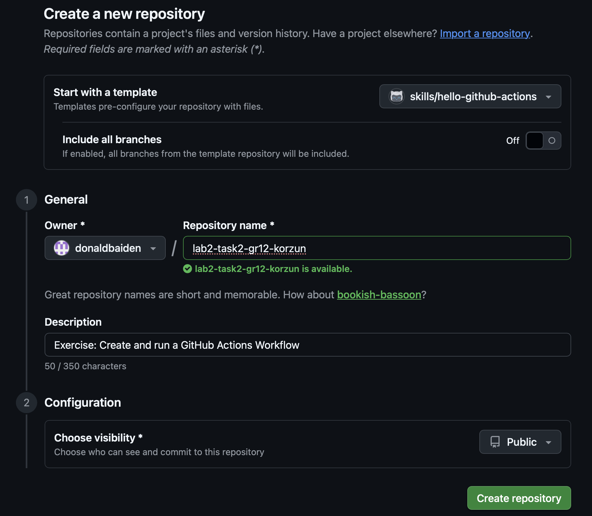
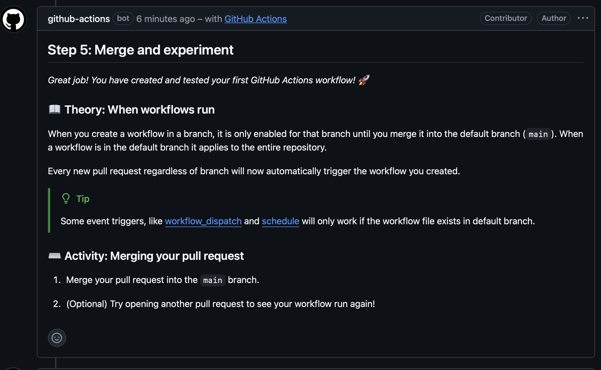
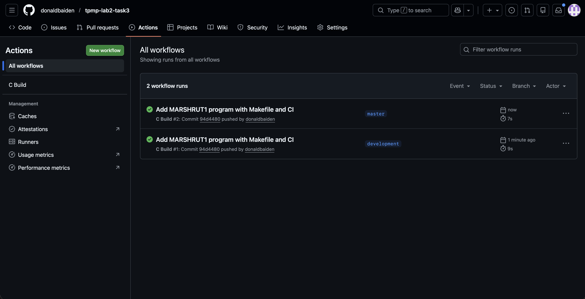

# Отчёт по лабораторной работе 2

**Автор:** Корзун Михаил, группа 12

---

## Задание 1. Консольное приложение в Repl.it

### Описание задачи

Дан массив натуральных чисел. Для каждого числа переставить его цифры так, чтобы получить максимально возможное число (вариант 12).

### Структура проекта

```
lab2-task1-gr12-korzun/
├── src/
│   └── main.c
├── .replit
├── .gitignore
├── README.md
└── CODE_OF_CONDUCT.md
```

### Создание репозитория из шаблона


### Импорт проекта в Repl.it


### Результат работы программы


### Pull Request



### Протокол тестирования

| № | Входные данные | Ожидаемый результат | Действительный результат | Тест пройден |
|---|---------------|--------------------|-----------------------|-------------|
| 1 | 312 4021 1987 | 321 4210 9871 | 321 4210 9871 | Да |
| 2 | 54321 100 9876 | 54321 100 9876 | 54321 100 9876 | Да |
| 3 | 1 | 1 | 1 | Да |
| 4 | 192837 | 983721 | 983721 | Да |
| 5 | 111 222 | 111 222 | 111 222 | Да |

---

## Задание 2. Курс GitHub Actions: Hello World

### Описание задачи

Изучить курс «Hello GitHub Actions» на GitHub Skills. Создать репозиторий `tpmp-lab2-task2` и пройти все шаги курса.

### Создание репозитория курса



### Прохождение курса

Курс был пройден. В процессе прохождения merge был выполнен вручную раньше, чем ожидал бот курса, из-за чего бот завис и не перешёл к следующему шагу автоматически.



---

## Задание 3. Структура MARSHRUT1

### Описание задачи

Описать структуру MARSHRUT1 (номер маршрута, начальный пункт, конечный пункт, длина). Реализовать функции: создание массива маршрутов, поиск минимальной длины, сортировка по длине, фильтрация по пункту. Вариант 12.

### Структура проекта

```text
tpmp-lab2-task3/
├── src/
│   ├── main.c        (клиентский модуль)
│   ├── marshrut.c    (серверный модуль)
│   └── marshrut.h    (интерфейсный модуль)
├── .github/workflows/
│   └── ci.yml
├── Makefile
├── .gitignore
└── README.md
```

### Сборка проекта

Проект собирается с помощью `make`. GitHub Actions настроен для автоматической сборки и запуска.



### Протокол тестирования

| № | Входные данные | Ожидаемый результат | Действительный результат | Тест пройден |
|---|---------------|--------------------|-----------------------|-------------|
| 1 | 3 маршрута: Minsk-Brest 350.5, Gomel-Vitebsk 280.0, Minsk-Grodno 290.0 | Минимальный: Gomel-Vitebsk 280.0 | Минимальный: Gomel-Vitebsk 280.0 | Да |
| 2 | Сортировка тех же 3 маршрутов по длине | Порядок: 280.0, 290.0, 350.5 | Порядок: 280.0, 290.0, 350.5 | Да |
| 3 | Фильтр по пункту "Minsk" | Маршруты №3 и №1 | Маршруты №3 и №1 | Да |
| 4 | Фильтр по пункту "Vitebsk" | Маршрут №2 | Маршрут №2 | Да |
| 5 | 1 маршрут: Brest-Minsk 350.0 | Минимальный: Brest-Minsk 350.0 | Минимальный: Brest-Minsk 350.0 | Да |

---

## Задание 4. Запись и чтение текстовых файлов

### Описание задачи

Структура «Школьник»: ФИО, пол, национальность, рост, вес, дата рождения, телефон, адрес, школа, класс. Чтение данных из текстового файла, вывод учеников 5-х классов, сохранение результата в новый файл. Вариант 12.

### Структура проекта

```text
tpmp-lab2-task4/
├── src/
│   ├── main.c        (клиентский модуль)
│   ├── student.c     (серверный модуль)
│   └── student.h     (интерфейсный модуль)
├── data/
│   └── input.txt
├── .github/workflows/
│   └── ci.yml
├── Makefile
├── .gitignore
└── README.md
```

### Сборка проекта

Проект собирается с помощью `make`. GitHub Actions настроен для автоматической сборки и запуска.


### Протокол тестирования

| № | Входные данные | Ожидаемый результат | Действительный результат | Тест пройден |
|---|---------------|--------------------|-----------------------|-------------|
| 1 | 5 учеников (3 из 5-го класса, 1 из 7-го, 1 из 6-го) | 3 ученика 5-го класса | 3 ученика 5-го класса | Да |
| 2 | Фильтр по 5-му классу | Ivanov, Sidorova, Morozova | Ivanov, Sidorova, Morozova | Да |
| 3 | Запись результата в output.txt | Файл создан с 3 записями | Файл создан с 3 записями | Да |
| 4 | Пустой файл | "Нет данных" | "Нет данных" | Да |
| 5 | Все ученики 5-го класса | Все выводятся | Все выводятся | Да |

